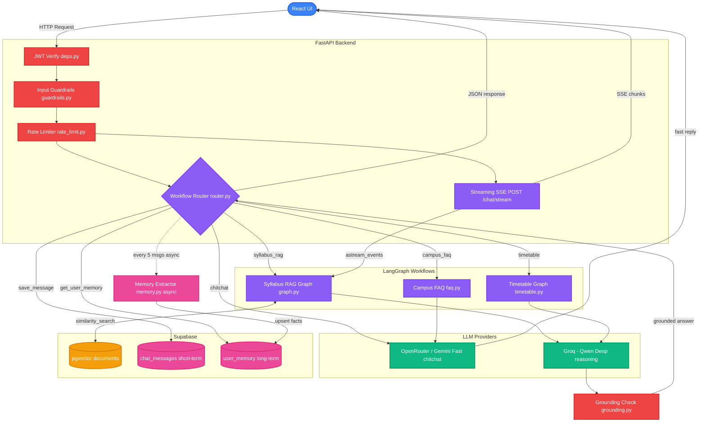

# 🎓 River — RoenRiviera Campus Friend AI

> A production-grade, dual-LLM campus assistant with memory, streaming, guardrails, RAG, and JWT auth — built on FastAPI + React + Supabase.

---

## ✨ Features

| Feature | Status | Description |
|---|---|---|
| **Dual-LLM Routing** | ✅ Live | Auto-classifies queries; routes chitchat to OpenRouter (fast), campus queries to Groq (deep reasoning) |
| **Syllabus RAG** | ✅ Live | Semantic vector search via Supabase pgvector + LangGraph orchestration |
| **Document Upload** | ✅ Live | Upload `.txt` / `.pdf` via UI — backend embeds and stores in Supabase `documents` table |
| **Timetable Conflict Check** | ✅ Live | LangGraph-driven schedule analysis with conflict detection |
| **Campus FAQ** | ✅ Live | Structured FAQ lookup workflow |
| **Voice Assistant** | ✅ Live | Edge-TTS + OpenRouter; real-time voice query processing |
| **AgentCore-style Memory** | ✅ Live | Short-term (`chat_messages`) + Long-term (`user_memory`) with background extraction |
| **Streaming Responses** | ✅ Live | SSE token-by-token streaming via `POST /chat/stream` → typing effect in UI |
| **Input Guardrails** | ✅ Live | Regex-based prompt injection filter on every request |
| **JWT Authentication** | ✅ Live | Real HS256 verification against Supabase JWT secret |
| **Per-User Rate Limiting** | ✅ Live | In-memory sliding-window limiter; 20 req/min per user |
| **Grounding Checks** | ✅ Live | Keyword-overlap + sentence-level evidence validation before answer delivery |

---

## 🏗️ System Architecture



---

## 📁 Project Structure

```
campus_friend/
├── README.md
├── .gitignore
│
├── backend/
│   ├── .env                          # API keys (never committed)
│   ├── requirements.txt              # Python dependencies
│   ├── supabase_setup.sql            # Supabase DB schema (pgvector)
│   ├── chat_memory_setup.sql         # Memory tables schema
│   │
│   ├── scripts/
│   │   └── seed_db.py                # Seed documents into vector DB
│   │
│   └── app/
│       ├── main.py                   # FastAPI app, CORS, middleware
│       ├── api/
│       │   ├── api_v1.py             # Router aggregator (/api/v1)
│       │   ├── deps.py               # JWT auth dependency (verify_token)
│       │   └── endpoints/
│       │       ├── chat.py           # POST /chat/, POST /chat/stream, GET /chat/history
│       │       ├── documents.py      # POST /documents/upload
│       │       └── voice.py          # POST /voice/query
│       │
│       ├── core/
│       │   ├── config.py             # Pydantic settings (all env vars)
│       │   ├── db.py                 # Supabase client + embeddings factory
│       │   ├── guardrails.py         # Input prompt-injection filter
│       │   ├── memory.py             # AgentCore short+long-term memory
│       │   ├── rate_limit.py         # IP-level middleware + per-user limiter
│       │   ├── payload_limit.py      # Request size guard middleware
│       │   └── security_headers.py   # Security headers middleware
│       │
│       ├── rag/
│       │   ├── graph.py              # LangGraph RAG + Timetable StateGraphs
│       │   ├── grounding.py          # Evidence sufficiency + citation mapping
│       │   └── llm.py                # classify_query(), GeminiProvider, GroqProvider
│       │
│       ├── schemas/
│       │   └── chat.py               # ChatRequest, ChatResponse Pydantic models
│       │
│       └── workflows/
│           ├── router.py             # Main dispatcher + SSE stream generator
│           ├── faq.py                # Campus FAQ workflow
│           └── timetable.py          # Timetable conflict-check workflow
│
└── frontend/
    ├── index.html
    ├── package.json
    ├── vite.config.ts
    └── src/
        ├── App.tsx                   # Main UI (chat, voice, upload, timetable)
        ├── index.css                 # Global styles
        ├── main.tsx                  # React entry point
        └── api/
            ├── chat.ts               # sendMessage() + streamMessage() SSE client
            ├── documents.ts          # uploadDocument()
            └── history.ts            # getChatHistory()
```

---

## 🛠️ Tech Stack

| Layer | Technology |
|---|---|
| **Frontend** | React 18, TypeScript, Vite, Lucide Icons |
| **Backend** | Python 3.11+, FastAPI, Uvicorn |
| **Orchestration** | LangGraph, LangChain |
| **LLMs** | Groq (Qwen), Google Gemini via OpenRouter |
| **Database / Vector Store** | Supabase (PostgreSQL + pgvector) |
| **Embeddings** | FastEmbed (local, no PyTorch dependency) |
| **Voice** | Edge-TTS, OpenRouter |
| **Auth** | Supabase JWT (HS256) |
| **Memory** | Supabase `chat_messages` + `user_memory` (AgentCore pattern) |

---

## 🚀 Getting Started

### Prerequisites
- Python 3.11+
- Node.js 18+
- A [Supabase](https://supabase.com) project with pgvector enabled

### 1. Clone and setup Supabase

Run these SQL files in your Supabase SQL Editor **in order**:
```
backend/supabase_setup.sql       ← creates the documents table + match_documents() function
backend/chat_memory_setup.sql    ← creates chat_messages + user_memory tables
```

### 2. Backend setup

```bash
cd backend
python -m venv venv

# Windows:
venv\Scripts\activate
# Mac/Linux:
source venv/bin/activate

pip install -r requirements.txt
```

Create `backend/.env`:
```env
PROJECT_NAME="RoenRiviera API"
API_V1_STR="/api/v1"

SUPABASE_URL="https://your-project.supabase.co"
SUPABASE_SERVICE_ROLE_KEY="your-service-role-key"
SUPABASE_JWT_SECRET="your-jwt-secret"

GEMINI_API_KEY="your-gemini-key"
GROQ_API_KEY="your-groq-key"
OPENROUTER_API_KEY="your-openrouter-key"
```

> **Where to find `SUPABASE_JWT_SECRET`:** Supabase Dashboard → Settings → JWT Keys → **Legacy JWT Secret** → Reveal

Seed the vector database (optional):
```bash
python scripts/seed_db.py
```

Start the backend:
```bash
uvicorn app.main:app --reload
```

API docs: `http://localhost:8000/docs`

### 3. Frontend setup

```bash
cd frontend
npm install
npm run dev
```

Visit: `http://localhost:5173`

---

## 🔌 API Reference

| Method | Endpoint | Auth | Description |
|---|---|---|---|
| `POST` | `/api/v1/chat/` | Bearer | Standard JSON chat response |
| `POST` | `/api/v1/chat/stream` | Bearer | SSE streaming chat (token-by-token) |
| `GET` | `/api/v1/chat/history/{conv_id}` | Bearer | Fetch conversation history |
| `POST` | `/api/v1/documents/upload` | Bearer | Upload and embed a document |
| `POST` | `/api/v1/voice/query` | Bearer | Voice query (returns audio + text) |

---

## 🧠 Memory Architecture (AgentCore Pattern)

River implements a two-tier memory system inspired by AWS Bedrock AgentCore:

```
Short-term Memory  →  chat_messages table
                       Every message (user + assistant) is persisted per conversation.

Long-term Memory   →  user_memory table
                       Every 5 messages, a background Groq task reads the conversation
                       and extracts durable facts + preferences into JSONB fields.
                       These are injected into the system prompt on the next request.
```

**Example:** Tell River "I'm a CS101 student who prefers short answers" — it permanently remembers this in `user_memory` and adapts all future responses automatically.

---

## 🔒 Security Features

| Feature | Implementation |
|---|---|
| JWT Auth | Real HS256 signature verification against Supabase JWT secret |
| Input Guardrails | Regex blocks "ignore previous instructions", "system prompt", etc. |
| Per-User Rate Limiting | Sliding window, 20 req/min, tied to JWT user ID |
| IP Rate Limiting | Middleware-level 20 req/min per IP address |
| Payload Size Limit | Request body size cap middleware |
| Security Headers | HSTS, X-Frame-Options, X-Content-Type-Options |

---

## 🗺️ Request Flow

```
User sends message
    │
    ▼
[JWT verify] ──────────────────► 401 if invalid
    │
    ▼
[Input Guardrail] ─────────────► blocked response if flagged
    │
    ▼
[Rate Limit] ──────────────────► 429 if exceeded
    │
    ▼
[classify_query()]
    │
    ├─ "simple" ──► OpenRouter/Gemini ──► fast text answer
    │
    └─ "complex" ─► LangGraph RAG Graph
                        │
                        ├─ retrieve_context()      ← pgvector similarity search
                        ├─ generate_rag_answer()   ← Groq LLM
                        └─ grounding_check()       ← evidence validation
                                │
                                ▼
                    [save_message] → chat_messages
                    [extract_and_update_memory async] → user_memory
                                │
                                ▼
                    JSON response  OR  SSE stream (token-by-token)
```

---

## 📄 License

MIT — Built for the RoenRiviera Hackathon 2026.

