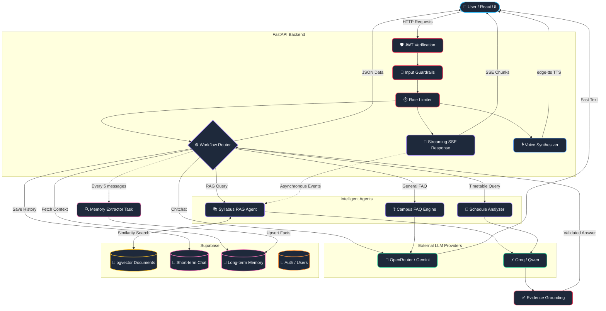

# Riviera

An intelligent, centralized campus platform designed to connect students with their educational materials, schedules, and peers seamlessly. Riviera combines an intuitive glassmorphic interface with a robust AI-powered backend to deliver real-time insights, natural voice interactions, and deep document understanding.

## Core Features

*   **Intelligent Knowledge Base**: Upload syllabi, notes, and official documents. Our Retrieval-Augmented Generation (RAG) pipeline indexes your materials for instantaneous query resolution.
*   **Conversational Voice Interface**: Speak directly to "River", your personalized campus assistant. Choose from multiple voices, adjust speech rate, and enjoy low-latency streaming responses via Edge-TTS and OpenRouter.
*   **Timetable Syncing & Conflict Detection**: Maintain your class schedule and automatically detect overlaps or conflicts in real-time.
*   **Discussion Forum**: Connect with peers, share resources, and discuss campus topics in an organized, threaded environment.

## Architecture

Riviera follows a modern decoupled architecture:

*   **Frontend**: Built with React and Vite. Employs a stunning dark-mode glassmorphism aesthetic with TailwindCSS and Lucide icons.
*   **Backend**: Powered by FastAPI (Python) for high-performance async endpoints.
*   **AI Orchestration**: Uses LangGraph and Groq for complex RAG pipelines, and OpenRouter for fast conversational routing.
*   **Database & Authentication**: Managed by Supabase (PostgreSQL), ensuring secure user sessions and reliable data persistence.
*   **Voice Engine**: Integrates `edge-tts` for dynamic, localized voice synthesis.



## Quick Start

### Prerequisites
- Node.js v18+
- Python 3.10+
- Supabase account & credentials
- Groq / OpenRouter API keys

### Environment Setup

1. **Backend**:
   ```bash
   cd backend
   python -m venv venv
   source venv/bin/activate  # On Windows: venv\Scripts\activate
   pip install -r requirements.txt
   cp .env.example .env # Configure your API keys here
   uvicorn app.main:app --reload
   ```

2. **Frontend**:
   ```bash
   cd frontend
   npm install
   cp .env.example .env # Configure your Vite API URLs here
   npm run dev
   ```

## Design Philosophy

Riviera was built with ethics and user experience at its core. It leverages AI not to replace learning, but to organize disparate campus information into a single, cohesive, and easily navigable dashboard. The interface is deliberately designed to be distraction-free, aesthetically pleasing, and highly responsive.
