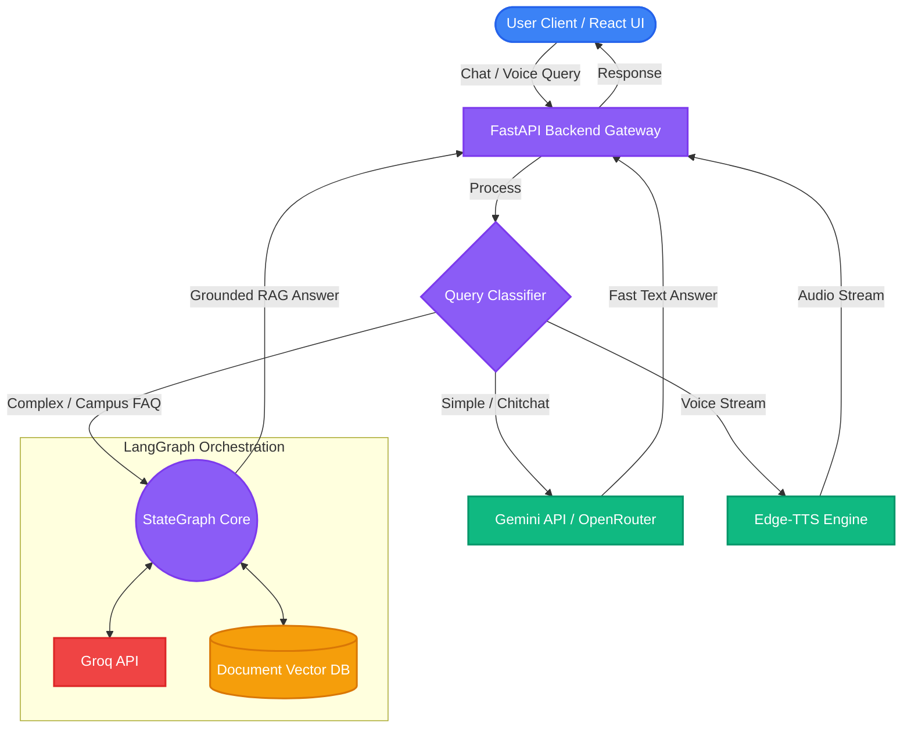

# RoenRiviera: Campus Friend AI 🎓🤖

An intelligent, dual-LLM AI assistant designed to enhance the campus experience at RoenRiviera University. Built for our hackathon submission, this project features both a responsive React frontend and a powerful FastAPI backend, orchestrating workflows with LangGraph.

## Features ✨

- **Dual-LLM Architecture**: Intelligently routes simple queries (chitchat) to a fast LLM and complex campus queries (syllabus, timetables) to a heavy reasoning model via Groq.
- **Campus FAQ & Syllabus RAG**: Retrieve specific answers from campus documentation.
- **Timetable Conflict Checking**: Avoid scheduling issues with intelligent timetable parsing.
- **Voice Capabilities**: Integrated Edge-TTS for a fully conversational voice assistant experience.

## Tech Stack 🛠️

- **Frontend**: React (TypeScript), Vite, TailwindCSS
- **Backend**: Python, FastAPI, Uvicorn
- **AI Ecosystem**: LangChain, LangGraph, Groq, OpenRouter, Google GenAI

## System Architecture 🏗️



## Getting Started 🚀

### 1. Backend Setup

```bash
cd backend
python -m venv venv
# Windows: venv\Scripts\activate
# Mac/Linux: source venv/bin/activate
pip install -r requirements.txt
```

Create a `.env` file in the `backend` directory with your API keys:
```env
GEMINI_API_KEY="your_gemini_key"
GROQ_API_KEY="your_groq_key"
OPENROUTER_API_KEY="your_openrouter_key"
VOICE_OPENROUTER_API_KEY="your_voice_openrouter_key"
```

Start the backend server:
```bash
uvicorn app.main:app --reload
```

### 2. Frontend Setup

```bash
cd frontend
npm install
npm run dev
```

Visit `http://localhost:5173` to interact with Campus Friend!
